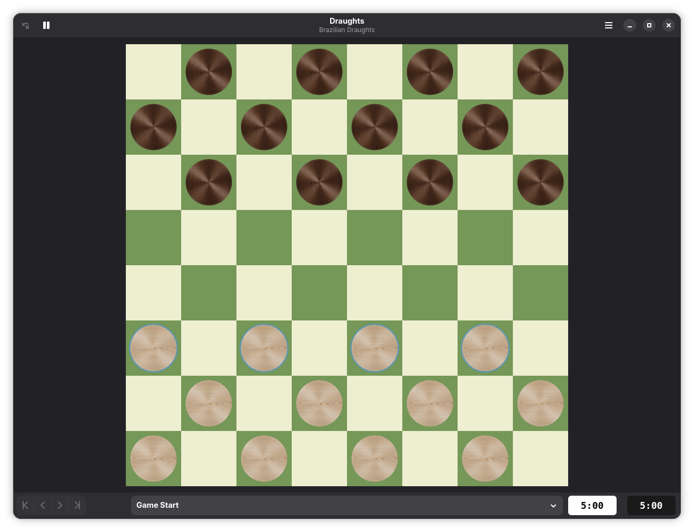
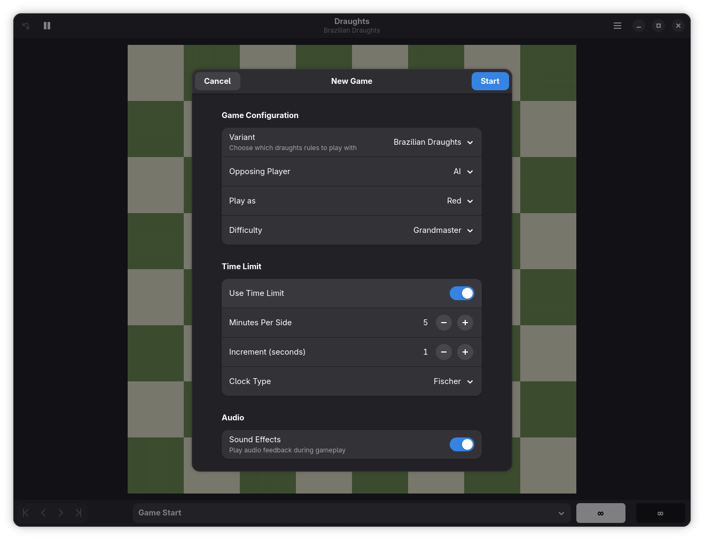
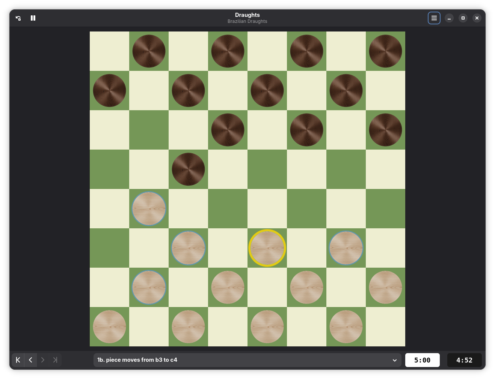
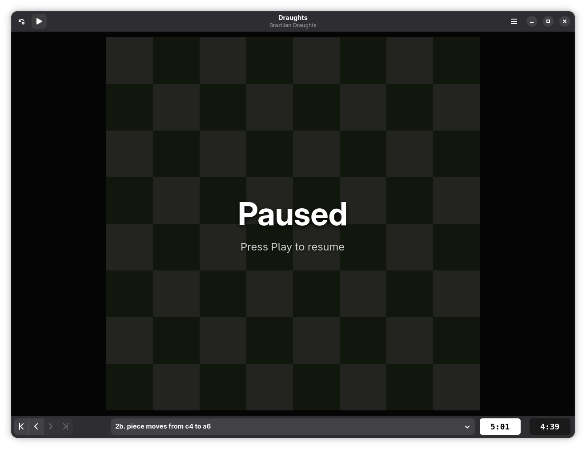
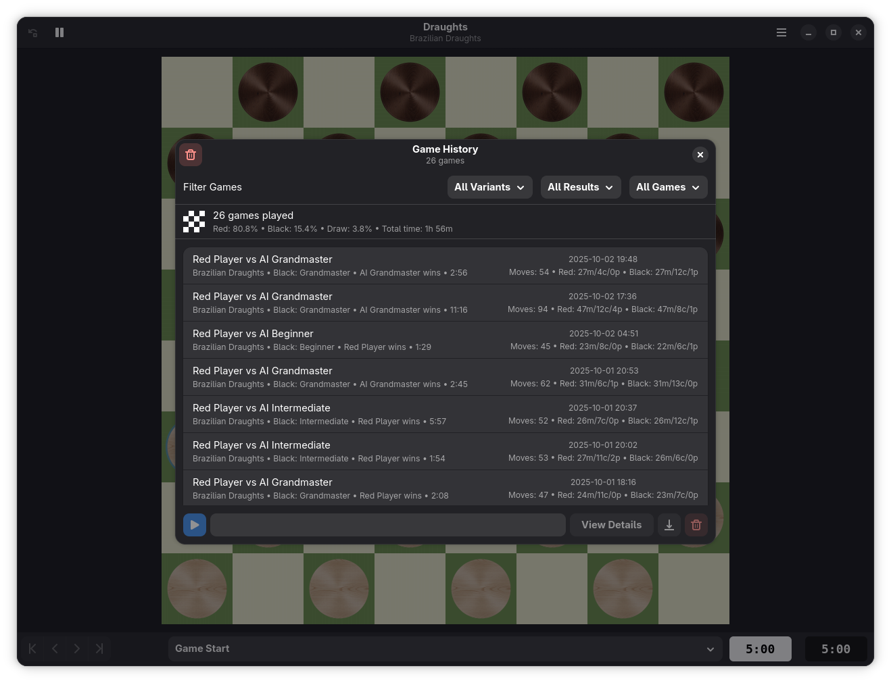
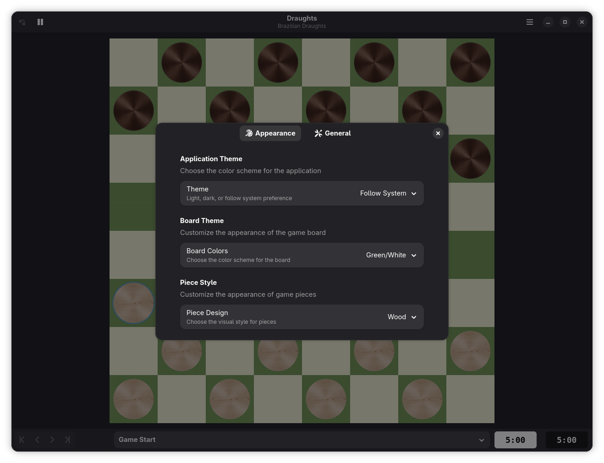

# Draughts

A comprehensive draughts (checkers) game for GNOME, featuring 16 international variants, AI opponents, and a beautiful modern interface.



## Features

### Game Variants
- **16 International Variants**: American Checkers, International Draughts, Russian, Brazilian, Italian, Spanish, Czech, Thai, German, Swedish, Pool, Turkish, Armenian, Gothic, Frisian, and Canadian
- **Different Board Sizes**: From 8x8 to 10x10 boards depending on variant
- **Authentic Rules**: Each variant implements official rules including forced captures, flying kings, and variant-specific move patterns

### Gameplay Modes
- **Human vs Human**: Play against a friend on the same computer
- **Human vs AI**: Challenge the computer with 10 difficulty levels (Beginner to Grandmaster)
- **AI vs AI**: Watch two AI opponents battle each other
- **Game Replay**: Review and replay any saved game from history

### AI System
- **10 Difficulty Levels**: From Beginner (random moves) to Grandmaster (deep strategic analysis)
- **Intelligent Evaluation**: Position evaluation considers material, king advancement, center control, and mobility
- **Minimax Algorithm**: Advanced search with alpha-beta pruning
- **Adaptive Depth**: Higher difficulties search deeper into the game tree

### Visual Features
- **Smooth Animations**: Pieces slide smoothly across the board with easing effects
- **Multiple Themes**: 5 board themes (Classic, Wood, Green, Blue, High Contrast)
- **Piece Styles**: 4 piece designs (Plastic, Wood, Metal, Bottle Cap)
- **Visual Feedback**: Highlighted valid moves, captures, and selected pieces
- **Responsive Design**: Adaptive UI that works on different screen sizes

### Game Features
- **Complete Move History**: Track every move with algebraic notation
- **Unlimited Undo/Redo**: Go back and forth through the game at any point
- **Move Navigation**: Jump to any point in the game history
- **Multi-Jump Support**: Handles complex sequential capture moves
- **Flying Kings**: Supports long-distance king moves in variants like International Draughts

### Timer System
- **Multiple Timer Modes**:
  - Countdown: Fixed time per player
  - Fischer Increment: Add time after each move
  - Bronstein Delay: Delay before time starts counting
- **Visual Indicators**: Clear display of remaining time for both players
- **Time Pressure Alerts**: Visual feedback when time is running low

### Audio & Accessibility
- **Sound Effects**: Audio feedback for moves, captures, king promotions, and game events
- **Volume Control**: Adjust or mute sound effects
- **Keyboard Navigation**: Full keyboard support for all game actions
- **Screen Reader Support**: Accessibility announcements for visually impaired users
- **High Contrast Mode**: Enhanced visibility for better accessibility

### Game Management
- **Game History**: Automatic saving of completed games
- **Statistics Tracking**: Win/loss records and game statistics
- **PDN Export**: Export games in Portable Draughts Notation format
- **Game Replay**: Replay any saved game move by move

## Screenshots

| Main Window | New Game Dialog |
|------------|-----------------|
|  |  |

| Active Gameplay | Game Paused |
|----------------|-------------|
|  |  |

| Game History | Preferences |
|--------------|-------------|
|  |  |

## Installation

### Flatpak (Recommended)

```bash
# Install from Flathub (coming soon)
flatpak install flathub io.github.tobagin.Draughts

# Run the application
flatpak run io.github.tobagin.Draughts
```

### Building from Source

#### Requirements
- Vala >= 0.56
- GTK4 >= 4.20
- LibAdwaita >= 1.8
- Meson >= 1.0
- Blueprint Compiler >= 0.18
- Flatpak and Flatpak Builder

#### Build Steps

```bash
# Clone the repository
git clone https://github.com/tobagin/Dama.git
cd Dama

# Build development version
./scripts/build.sh --dev

# Run the application
flatpak run io.github.tobagin.Draughts.Devel
```

## Usage

### Starting a New Game

1. Click the menu button (☰) in the header bar
2. Select "New Game"
3. Choose your game variant
4. Configure players (Human vs AI, Human vs Human, or AI vs AI)
5. Optionally enable time controls
6. Click "Start Game"

### Making Moves

- **Click to Select**: Click a piece to select it (valid moves will be highlighted)
- **Click to Move**: Click a highlighted square to move the selected piece
- **Multi-Jump Captures**: The piece will remain selected after a capture if more jumps are available
- **Forced Captures**: Capture moves are mandatory when available (enforced by the game)

### Keyboard Shortcuts

- `Ctrl+N` - New Game
- `Ctrl+Z` - Undo Move
- `Ctrl+Shift+Z` - Redo Move
- `Ctrl+H` - Show Move History
- `Ctrl+,` - Preferences
- `Ctrl+Q` - Quit
- `F1` - Help
- `F11` - Fullscreen

### Game History

View and replay your past games:
1. Open the menu and select "Game History"
2. Browse your saved games
3. Click "Replay" to watch a game move-by-move
4. Export games to PDN format for analysis

## Game Variants Guide

### American Checkers (8x8)
- Standard checkers rules
- Men move diagonally forward, kings move diagonally in all directions
- Captures are mandatory
- Kings can only move one square at a time

### International Draughts (10x10)
- Played on 10x10 board
- Flying kings (can move multiple squares)
- Majority capture rule (must capture the maximum number of pieces)
- Men can capture backwards

### Russian Draughts (8x8)
- Men can capture backwards
- Kings can move multiple squares (flying kings)
- Promoted piece can continue capturing in the same turn

For detailed rules of each variant, see the in-game rules documentation (Menu → Variant Rules).

## Technical Details

### Built With
- **GTK4** - Modern GNOME toolkit
- **LibAdwaita** - Adaptive GNOME widgets
- **Vala** - Object-oriented language compiling to C
- **Blueprint** - Declarative UI markup
- **Meson** - Build system
- **Flatpak** - Application packaging

### Architecture
- **MVC Pattern**: Clean separation of game logic and UI
- **Unified Rule Engine**: Single engine handles all 16 variants
- **Async AI**: AI calculations run on background threads
- **Smooth Animations**: GTK tick callbacks for fluid motion

## Contributing

Contributions are welcome! Please feel free to submit issues and pull requests.

### Development Setup

```bash
# Fork the repository
git clone https://github.com/yourusername/Dama.git
cd Dama

# Create a feature branch
git checkout -b feature/your-feature-name

# Make your changes and test
./scripts/build.sh --dev
flatpak run io.github.tobagin.Draughts.Devel

# Commit and push
git commit -am "Add your feature"
git push origin feature/your-feature-name

# Create a Pull Request on GitHub
```

### Code Style
- Follow GNOME coding style guidelines
- Use 4 spaces for indentation
- Write clear, descriptive commit messages
- Add comments for complex logic

## License

This project is licensed under the GNU General Public License v3.0 or later. See the [LICENSE](LICENSE) file for details.

## Credits

### Developer
- **Thiago Fernandes** ([@tobagin](https://github.com/tobagin))

### Acknowledgments
- **GNOME Project** - For the incredible platform
- **LibAdwaita Contributors** - For beautiful adaptive components
- **Vala Team** - For the elegant programming language
- **International Draughts Community** - For rules documentation and variants

## Support

- **Bug Reports**: [GitHub Issues](https://github.com/tobagin/Dama/issues)
- **Documentation**: [Wiki](https://github.com/tobagin/Dama/wiki)
- **Source Code**: [GitHub](https://github.com/tobagin/Dama)

---

Enjoy playing Draughts! 🎯
