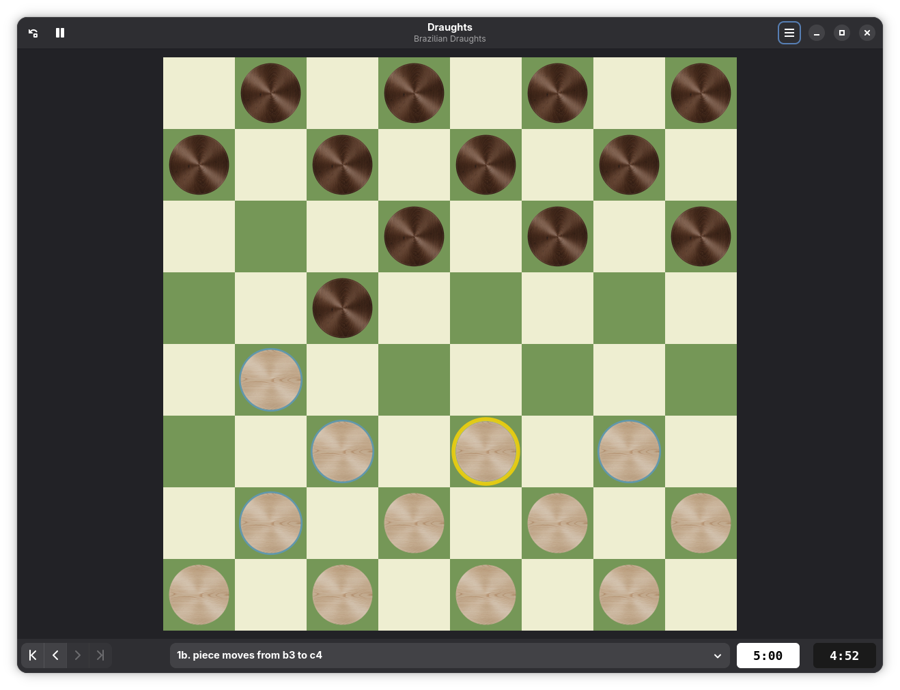
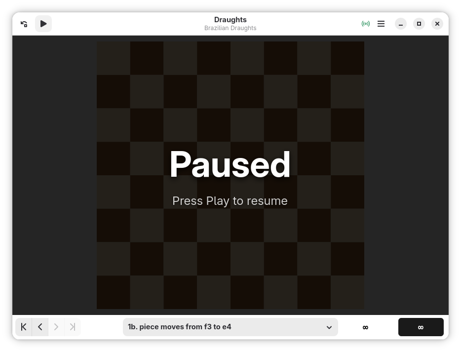

# Draughts

A comprehensive draughts (checkers) game for GNOME, featuring 16 international variants, AI opponents, online multiplayer, and a beautiful modern interface.


## 🎉 Version 2.1.0 - AI Revolution

Draughts 2.1.0 brings significant improvements to the AI engine, making it a formidable opponent with strategic depth.

### 🆕 What's New in 2.1.0
- 🧠 **Proper Position Evaluator**: The AI now understands complex positional concepts like center control, mobility, and material value.
- 📚 **Opening Book**: Standard openings are now played by the AI in the early game, providing a more authentic challenge.
- ✨ **New Icons**: Fresh new application icons (Thanks to @oiimrosabel).
- 🐛 **Build Fixes**: Resolved compilation issues and verified cross-platform builds.
- 📝 **Documentation**: Updated guides and walkthroughs for the new features.

For detailed release notes and version history, see [CHANGELOG.md](CHANGELOG.md).

## Features

### 🎮 Game Variants
- **16 International Variants**: American Checkers, International Draughts, Russian, Brazilian, Italian, Spanish, Czech, Thai, German, Swedish, Pool, Turkish, Armenian, Gothic, Frisian, and Canadian
- **Different Board Sizes**: From 8×8 to 12×12 boards depending on variant
- **Authentic Rules**: Each variant implements official rules including forced captures, flying kings, and variant-specific move patterns

### 🌍 Gameplay Modes
- **Online Multiplayer**: Play against opponents worldwide in real-time
  - Room-based matchmaking with 6-character room codes
  - Quick match to find random opponents
  - Automatic reconnection with session persistence
  - Visual disconnect overlay when opponent loses connection
  - Real-time game state synchronization
- **Human vs Human**: Play against a friend on the same computer
- **Human vs AI**: Challenge the computer with 10 difficulty levels (Beginner to Grandmaster)
- **AI vs AI**: Watch two AI opponents battle each other
- **Game Replay**: Review and replay any saved game from history

### 🧠 AI System
- **10 Difficulty Levels**: From Beginner (random moves) to Grandmaster (deep strategic analysis)
- **Intelligent Evaluation**: Position evaluation considers material, king advancement, center control, and mobility
- **Minimax Algorithm**: Advanced search with alpha-beta pruning
- **Opening Book**: Knowledge of standard opening lines

### 🎨 Visual Features
- **Smooth Animations**: Pieces slide smoothly across the board with easing effects
- **Multiple Themes**: 5 board themes (Classic, Wood, Green, Blue, High Contrast)
- **Piece Styles**: 4 piece designs (Plastic, Wood, Metal, Bottle Cap)
- **Visual Feedback**: Highlighted valid moves, captures, and selected pieces
- **Responsive Design**: Adaptive UI that works on different screen sizes

### ⏱️ Timer System
- **Multiple Timer Modes**:
  - Countdown: Fixed time per player
  - Fischer Increment: Add time after each move
  - Bronstein Delay: Delay before time starts counting
- **Time Pressure Alerts**: Visual feedback when time is running low

### 🔊 Audio & Accessibility
- **Sound Effects**: Audio feedback for moves, captures, king promotions, and game events
- **Keyboard Navigation**: Full keyboard support for all game actions
- **Screen Reader Support**: Accessibility announcements for visually impaired users
- **High Contrast Mode**: Enhanced visibility for better accessibility

## Screenshots

| Main Window | New Game Dialog |
|------------|-----------------|
|  |  |

| Active Gameplay | Game Paused |
|----------------|-------------|
|  |  |

| Game History | Preferences |
|--------------|-------------|
|  |  |

## Installation

### Flatpak (Recommended)

[](https://flathub.org/en/apps/io.github.tobagin.Draughts)

### From Source

#### Requirements
- Vala >= 0.56
- GTK4 >= 4.20
- LibAdwaita >= 1.8
- Meson >= 1.0
- Blueprint Compiler >= 0.18
- Flatpak and Flatpak Builder

#### Build Steps

```bash
# Clone the repository
git clone https://github.com/tobagin/Dama.git
cd Dama

# Build development version
./scripts/build.sh --dev

# Run the application
flatpak run io.github.tobagin.Draughts.Devel
```

## Usage

### Starting a New Game
1. Click the menu button (☰) in the header bar
2. Select "New Game"
3. Choose your game variant and configure players
4. Click "Start Game"

### Keyboard Shortcuts
- `Ctrl+N` - New Game
- `Ctrl+M` - Play Online (Multiplayer)
- `Ctrl+Z` - Undo Move
- `Ctrl+Shift+Z` - Redo Move
- `Ctrl+H` - Show Move History
- `Ctrl+,` - Preferences
- `F1` - Help
- `F11` - Fullscreen

## Contributing

Contributions are welcome! Please feel free to submit issues and pull requests.

1. Fork the repository
2. Create your feature branch (`git checkout -b feature/amazing-feature`)
3. Commit your changes (`git commit -am 'Add some amazing feature'`)
4. Push to the branch (`git push origin feature/amazing-feature`)
5. Open a Pull Request

## License

This project is licensed under the GNU General Public License v3.0 or later. See the [LICENSE](LICENSE) file for details.

## Credits

### Developer
- **Thiago Fernandes** ([@tobagin](https://github.com/tobagin))

### Acknowledgments
- **GNOME Project** - For the incredible platform
- **LibAdwaita Contributors** - For beautiful adaptive components
- **International Draughts Community** - For rules documentation and variants

## Support

- **Bug Reports**: [GitHub Issues](https://github.com/tobagin/Draughts/issues)
- **Documentaion**: [Wiki](https://github.com/tobagin/Draughts/wiki)
