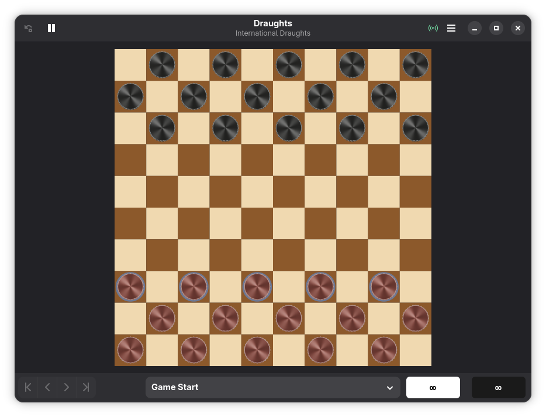
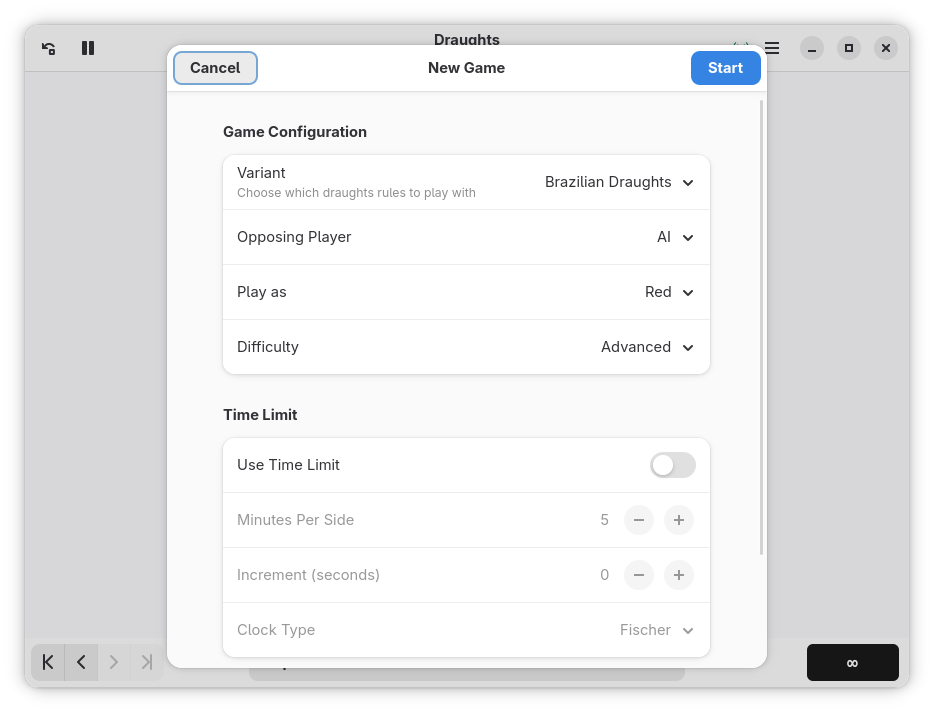
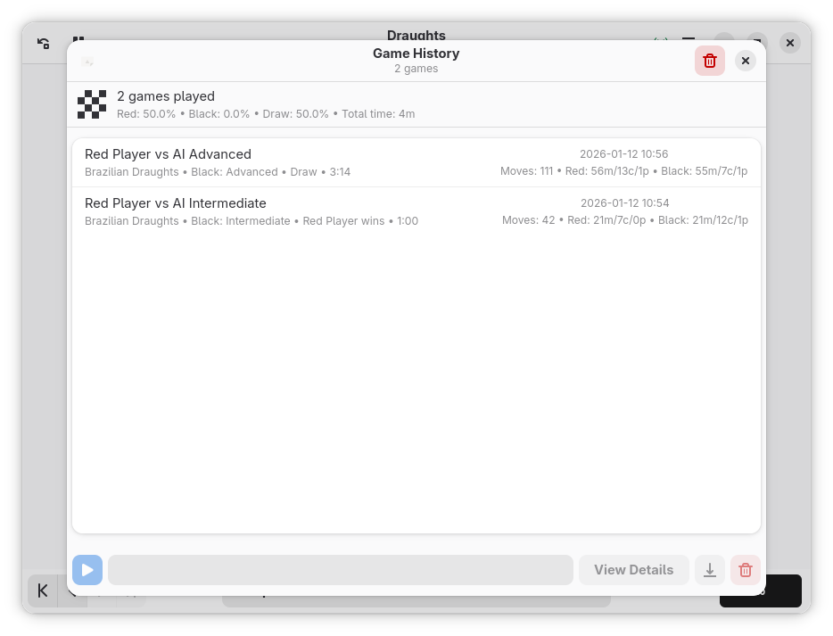
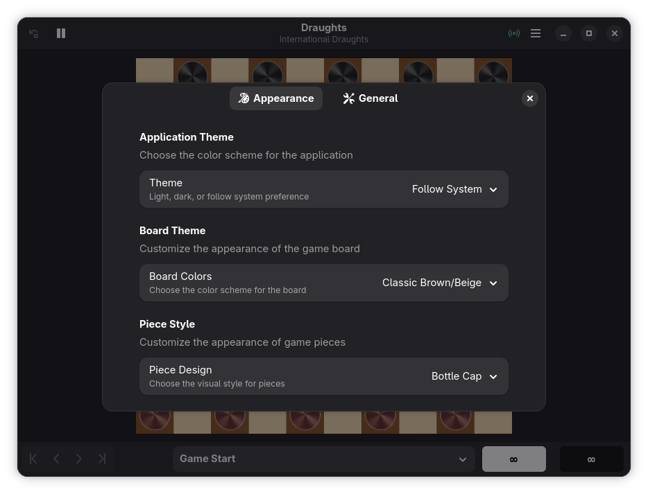

# Draughts

A comprehensive draughts (checkers) game for GNOME.

<div align="center">



<a href="https://flathub.org/apps/io.github.tobagin.Draughts"></a>
<a href="https://ko-fi.com/tobagin"></a>

</div>

## 🎉 Version 2.1.1 - Polish & Refinement

**Draughts 2.1.1** focuses on polishing the documentation and presentation, following the major AI update.

### ✨ Key Features

- **🧠 Smarter AI**: The new Position Evaluator understands strategy, material value, and center control.
- **📚 Opening Knowledge**: The AI now plays standard openings like "Old Faithful" for a realistic challenge.
- **🎨 Fresh Look**: Beautiful new application icons (Thanks to @oiimrosabel).
- **🛠️ Stability**: Improved build reliability and performance.

For detailed release notes and version history, see [CHANGELOG.md](CHANGELOG.md).

## Features

### Core Features
- **16 Game Variants**: Play International, American, Russian, Brazilian, Frisian, and 11 other variants.
- **Online Multiplayer**: Challenge opponents worldwide with room codes or quick matchmaking.
- **Skill Levels**: 10 difficulty levels ranging from Beginner to Grandmaster.

### User Experience
- **Adaptive Interface**: Modern adaptive design that works on desktop and mobile.
- **Themes & Styles**: Customize your experience with 5 board themes and 4 piece styles.
- **Review Tools**: Full move history, undo/redo, and game replay functionality.

### Accessibility
- **Inclusive Design**: Full keyboard navigation and screen reader support.
- **High Contrast**: Dedicated modes for better visibility.
- **Sound Effects**: Audio feedback for all game actions.

## Screenshots

| Main Window | New Game |
|-------------|----------|
|  |  |

| Game History | Preferences |
|--------------|-------------|
|  |  |

## Building from Source

```bash
# Clone the repository
git clone https://github.com/tobagin/Draughts.git
cd Draughts

# Build and install development version
./scripts/build.sh --dev

# Run the application
flatpak run io.github.tobagin.Draughts.Devel
```

## Usage

### Basic Usage

1.  **New Game**: Click the menu button (☰) and select "New Game".
2.  **Online Play**: Use `Ctrl+M` or select "Play Online" to join the global lobby.
3.  **Shortcuts**: Press `F1` to see all available keyboard shortcuts.

### Privacy

**Draughts** respects your privacy.
-   **No Telemetry**: We do not track your usage.
-   **Online Play**: Minimal data (moves, game status) is transmitted only during multiplayer matches.
-   **Local Data**: Game history and preferences are stored locally on your device.

## Contributing

Contributions are welcome! Please see [CONTRIBUTING.md](CONTRIBUTING.md) for guidelines.

-   **Bug Reports**: [GitHub Issues](https://github.com/tobagin/Draughts/issues)
-   **Discussions**: [GitHub Discussions](https://github.com/tobagin/Draughts/discussions)

## License

Draughts is licensed under the [GNU GPLv3+](LICENSE).

## Acknowledgments

-   **GNOME Project**: For the incredible platform.
-   **International Draughts Community**: For preserving the rules and variants.
-   **LibAdwaita**: For the beautiful UI components.
